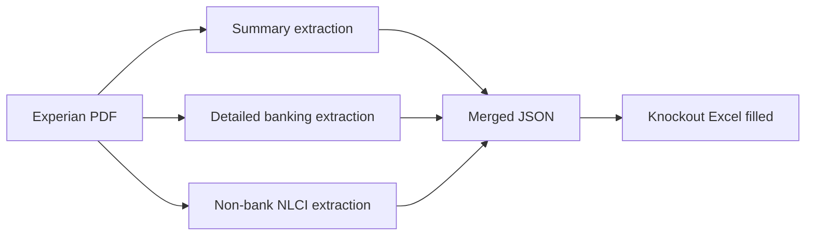

# AIgent Credit — Codebase study guide

This repository automates **credit assessment paperwork**: it reads **Experian-style credit report PDFs**, extracts structured fields, and **fills a “Knockout Matrix” Excel workbook** (`Knockout Matrix Template.xlsx`) so underwriters do not have to copy scores, limits, and risk indicators by hand.

---

## End-to-end flow

1. **Extract** three logical views from the same PDF (each module opens the PDF independently today).
2. **Merge** those views into one JSON object (`merged_credit_report.py`).
3. **Map** merged data to the long text labels used in the Knockout sheet (`build_knockout_data` in `insert_excel_file.py`).
4. **Write** values into the correct rows/columns in the `Knock-Out` worksheet and save `*_FILLED.xlsx`.
5. **Validate / highlight** cells where the inserted value matches “knockout” criteria described in column L (`column_l_validator.py`).

---

## What each Python file does

| File | Role |
|------|------|
| **`load_file_version.py`** | Reads full PDF text with `pdfplumber`, then uses **regex** helpers to pull **summary / particulars** fields: names, i-SCORE, incorporation year, legal flags, enquiry counts, multi-subject fields, dates like “Last Updated by Experian”, etc. This is the “front of report” structured data. |
| **`Detailed_Credit_Report_Extractor.py`** | Locates the **DETAILED CREDIT REPORT (BANKING ACCOUNTS)** region and parses **account lines**: balances, limits, **overdraft** outstanding vs limit, **CCRIS-style digit/MIA conduct** patterns, legal status codes, and per-section totals. Output is nested under `detailed_credit_report` with `sections` and `account_line_analysis`. |
| **`Non_Bank_Lender_Credit_Information.py`** | Parses the **NON-BANK LENDER CREDIT INFORMATION (NLCI)** block: totals, per-record stats, **legal markers** (e.g. LOD, SUE), and month grids for conduct. |
| **`pdf_utils.py`** | Shared helpers: **Tk file pickers** for PDF/Excel, **money parsing**, and **marker-based line extraction** between start/end strings in PDF text. |
| **`merged_credit_report.py`** | **Orchestrator**: calls the three extractors, returns one dict with `summary_report`, `detailed_credit_report`, and `non_bank_lender_credit_information`. Can dump JSON via CLI (`--pdf`, `--output`, `--pretty`). |
| **`insert_excel_file.py`** | **Main Excel pipeline**: optionally loads precomputed JSON or runs `merge_reports`, builds a **label → value** map for the Knockout matrix (including multi-subject columns), finds the **Issuer** column and row labels in column D, writes data, applies **per-section** inserts for CCRIS conduct and overdraft rows, runs **column L highlighting**, saves `Knockout Matrix Template_FILLED.xlsx` (name derived from input). CLI: `--excel`, `--merged-json`, `--pdf`, `--issuer`. |
| **`column_l_validator.py`** | For each Knock-Out row, compares the **issuer’s cell** to the **criterion text in column L** (scores, numeric thresholds, “no / N/A”, MIA text patterns, etc.). Matching cells get **red bold** font. Can also be used standalone via its own `argparse` entry. |

---

## Important concepts in the Excel step

- **Sheet name** is fixed: `Knock-Out`.
- **Row labels** are matched in **column D** (normalized text), so the template wording must stay aligned with the strings in code (see `MULTI_COL_PATTERNS` and `build_knockout_data`).
- **Multi-subject reports**: the code detects multiple “Name Of Subject” style entries and writes **Subject 2, Subject 3, …** columns by offsetting from the Issuer column (steps of two columns).
- **Derived fields**: examples include **credit score → letter grade** (`SCORE_RANGE_EQUIVALENTS`), **overdraft YES/NO** from aggregated comparisons, **banking facility** outstanding vs limit strings, and **NLCI conduct** from MIA statistics or record counts.

---

## Typical commands

- **Merge PDF to JSON only** (inspect raw extraction):

  `python merged_credit_report.py --pdf /path/to/report.pdf --output merged_credit_report.json --pretty`

- **Fill the Knockout workbook** (PDF picker if `--pdf` omitted; template resolved next to script or cwd):

  `python insert_excel_file.py --pdf /path/to/report.pdf`

- **Fill from saved JSON** (faster repeat runs):

  `python insert_excel_file.py --merged-json merged_credit_report.json`

---

## Related docs in the repo

- **`BUILD_INSTRUCTIONS.md` / `REBUILD_INSTRUCTIONS.md`** — packaging (e.g. PyInstaller EXE).
- **`DISTRIBUTION_GUIDE.md`** — what to ship with the executable (`Knockout Matrix Template.xlsx` + EXE).
- **`TROUBLESHOOTING.md`** — operational issues.

---

## Dependencies (conceptual)

- **`pdfplumber`** — PDF text extraction.
- **`openpyxl`** — read/write `.xlsx`.
- **`tkinter`** — native file dialogs (`pdf_utils`).

---

## Mental model

Treat the codebase as a **specialized ETL pipeline**: **PDF → structured JSON → Excel layout aligned to a fixed underwriting template**, with an extra **rules pass** (column L) to visually flag rows that meet knockout conditions.
